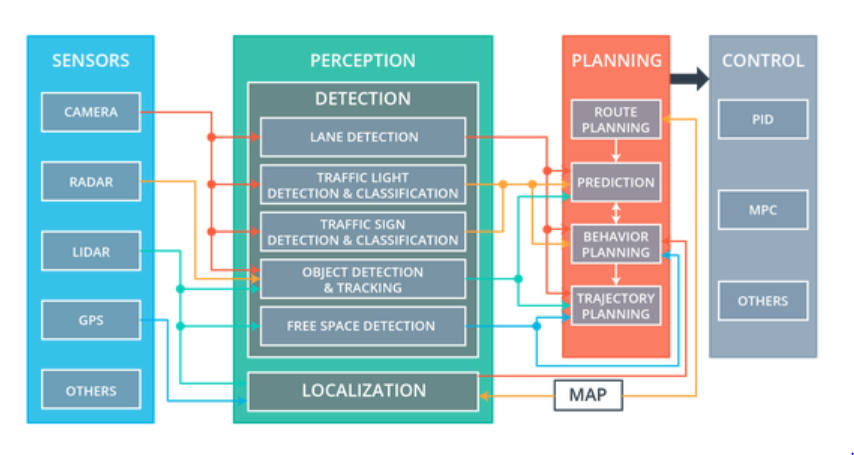

This is the project repo for the final project of the Udacity Self-Driving Car Nanodegree: Programming a Real Self-Driving Car. For more information about the project, see the project introduction [here](https://classroom.udacity.com/nanodegrees/nd013/parts/6047fe34-d93c-4f50-8336-b70ef10cb4b2/modules/e1a23b06-329a-4684-a717-ad476f0d8dff/lessons/462c933d-9f24-42d3-8bdc-a08a5fc866e4/concepts/5ab4b122-83e6-436d-850f-9f4d26627fd9).

Please use **one** of the two installation options, either native **or** docker installation.

### Native Installation

* Be sure that your workstation is running Ubuntu 16.04 Xenial Xerus or Ubuntu 14.04 Trusty Tahir. [Ubuntu downloads can be found here](https://www.ubuntu.com/download/desktop).
* If using a Virtual Machine to install Ubuntu, use the following configuration as minimum:
  * 2 CPU
  * 2 GB system memory
  * 25 GB of free hard drive space

  The Udacity provided virtual machine has ROS and Dataspeed DBW already installed, so you can skip the next two steps if you are using this.

* Follow these instructions to install ROS
  * [ROS Kinetic](http://wiki.ros.org/kinetic/Installation/Ubuntu) if you have Ubuntu 16.04.
  * [ROS Indigo](http://wiki.ros.org/indigo/Installation/Ubuntu) if you have Ubuntu 14.04.
* [Dataspeed DBW](https://bitbucket.org/DataspeedInc/dbw_mkz_ros)
  * Use this option to install the SDK on a workstation that already has ROS installed: [One Line SDK Install (binary)](https://bitbucket.org/DataspeedInc/dbw_mkz_ros/src/81e63fcc335d7b64139d7482017d6a97b405e250/ROS_SETUP.md?fileviewer=file-view-default)
* Download the [Udacity Simulator](https://github.com/udacity/CarND-Capstone/releases).

### Docker Installation
[Install Docker](https://docs.docker.com/engine/installation/)

Build the docker container
```bash
docker build . -t capstone
```

Run the docker file
```bash
docker run -p 4567:4567 -v $PWD:/capstone -v /tmp/log:/root/.ros/ --rm -it capstone
```

### Port Forwarding
To set up port forwarding, please refer to the [instructions from term 2](https://classroom.udacity.com/nanodegrees/nd013/parts/40f38239-66b6-46ec-ae68-03afd8a601c8/modules/0949fca6-b379-42af-a919-ee50aa304e6a/lessons/f758c44c-5e40-4e01-93b5-1a82aa4e044f/concepts/16cf4a78-4fc7-49e1-8621-3450ca938b77)

### Usage

1. Clone the project repository
```bash
git clone https://github.com/udacity/CarND-Capstone.git
```

2. Install python dependencies
```bash
cd CarND-Capstone
pip install -r requirements.txt
```
3. Make and run styx
```bash
cd ros
catkin_make
source devel/setup.sh
roslaunch launch/styx.launch
```
4. Run the simulator

### Real world testing
1. Download [training bag](https://s3-us-west-1.amazonaws.com/udacity-selfdrivingcar/traffic_light_bag_file.zip) that was recorded on the Udacity self-driving car.
2. Unzip the file
```bash
unzip traffic_light_bag_file.zip
```
3. Play the bag file
```bash
rosbag play -l traffic_light_bag_file/traffic_light_training.bag
```
4. Launch your project in site mode
```bash
cd CarND-Capstone/ros
roslaunch launch/site.launch
```
5. Confirm that traffic light detection works on real life images

### Carla Architecture
Carla is the name of a Udacity self-driving car, whose computer would run students' Capstone project code to see how well it drives around the test track.

From structure perspective, Carla has four subsystem as illustrated below: sensors, perception, planning, and control. The data flow direction is from left to right, with each subsystem's output taken as input for various components of the next subsystem.



Carla's Sensors subsystem consists of physical hardware that gathers data about the environment, in the form of camera, radar and lidar, and sometimes other types of sensors too. Cameras are mounted behind the rear view mirror in a row, a single radar is embedded in the front bumper, and a lidar is mounted on the roof. 

Raw sensor data is then interpreted by Perception subsystem, where detection of relevant objects in surrounding area, and localization of Carla itself happens. For camera images, they serve as inputs for the detection of lanes, traffic lights and signs, and other objects outside the vehicle, processed by deep learning and computer vision algorithms. For radar and lidar sensor measurements, they provide information that can be translated into distance, speed, and relative position of objects with reference to the vehicle, thus enable us to track the motion of other vehicles, pedestrians, bicycles, etc. Since lidar provides three-dimensional information about the surroundings, include surface characteristics, it also contributes to localization of Carla by comparing the scanned environment to a high-definition map. By combining GPS and lidar data, the precision of Carla's localization can reach 10 centimeters or less.

The output of Perception subsystem is then routed to the Planning subsystem. The path planning components uses perception data to predict the movements of other vehicles on the road, and evaluate different behaviors to decide which one is best for current scenario. Then the trajectory planning block would calculate a series of waypoints for Carla to follow, based on the chosen behavior. For example, if traffic light detection and classification component detects red light, then it is reasonable to predict that the vehicle in front of Carla would slow down, consequently the best behavior might be decelerate, and new waypoints would be built with target velocities being slower than current velocity and target lane remaining as current lane. Similarly, if free space is detected in adjacent lanes, or if a sign with different speed limit is detected, the Planning system would be affected and Carla might be instructed to behave differently.

The final subsystem Control subsystem takes the list of waypoints and target velocities calculated by Planning subsystem as input. Carla uses the simple proportional-integral-derivative (PID) controller to map waypoints to steering and throttle commands, and the commands would be ultimately translated to Controller Area Network (CAN) messages executed by various actuators, most commonly the engine control module and power steering module.

In summary: sensor and perception subsystems collect data and interpret data to detect objects around the vehicle and localize itself; planning subsystem determines appropriate behavior and generate a trajectory accordingly; and finally the control system drives Carla along that trajectory.
